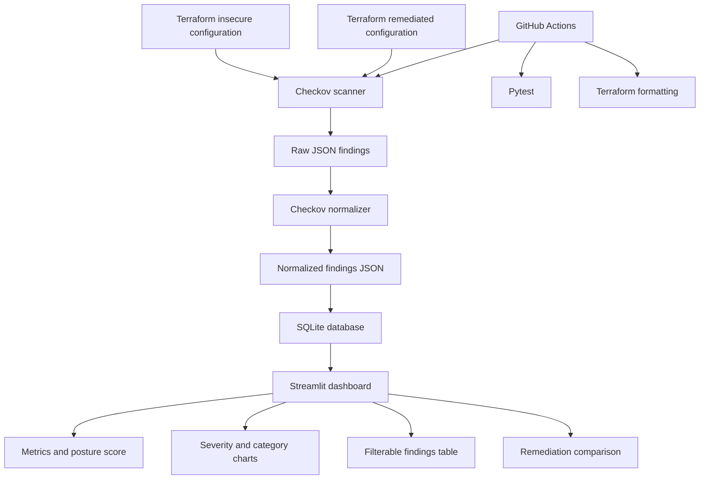
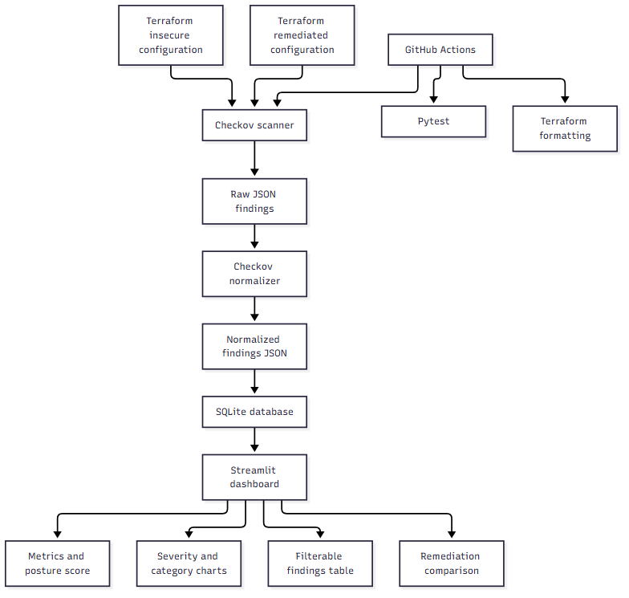

# CloudGuard CSPM Dashboard

CloudGuard is a local cloud security posture management dashboard that identifies and prioritizes security misconfigurations in Terraform infrastructure code.

## Project objective

This project demonstrates how a Cloud Security Analyst can:

- Review infrastructure-as-code
- Detect cloud security misconfigurations
- Prioritize findings by risk
- Recommend remediation
- Compare insecure and remediated configurations
- Present findings through a dashboard

## Current scope

The current implementation scans Terraform configurations using Checkov. It includes:

- An intentionally insecure Terraform environment
- A remediated Terraform environment
- Raw Checkov JSON output
- Normalized security findings
- Category and severity classification
- Explainable risk scoring
- Automated tests

## Architecture

```text
Terraform configurations
          ↓
Checkov scanner
          ↓
Raw JSON findings
          ↓
Python normalizer
          ↓
SQLite database
          ↓
Streamlit dashboard
```

## Findings normalization

Checkov produces scanner-specific JSON output. The project normalizes failed checks into a consistent finding model containing:

- Category
- Severity
- Risk score
- Environment
- Resource
- Source location
- Remediation guidance

The normalizer can process both:

- `data/raw/insecure-findings.json`
- `data/raw/remediated-findings.json`

The severity values are portfolio-level heuristic ratings, not official AWS or Checkov ratings. The project documents the heuristic so that the scoring is transparent and reproducible.

## SQLite database

Normalized findings are loaded into a local SQLite database at:

```text
data/cloudguard.db
```

The database contains:

- `scan_runs`: scan-level metrics and severity counts
- `findings`: normalized individual security findings

The database is generated locally and excluded from Git. It can be recreated from the normalized JSON files.

## Continuous security validation

GitHub Actions validates the project on pushes to `main` and on pull requests.

The workflow:

- Runs the Python test suite
- Verifies Terraform formatting
- Scans the remediated Terraform configuration with Checkov
- Scans the intentionally insecure baseline for demonstration

The Checkov scans currently run as informational CI steps because the remediated configuration still contains documented findings. The Python test suite and Terraform formatting checks remain blocking quality gates.

## CI security-gate decision

Checkov scans for both Terraform environments currently run as informational CI steps.

The insecure environment is intentionally vulnerable and is included to demonstrate baseline detection. The remediated environment has reduced failed checks from 25 to 7.

The remaining findings are documented in the project remediation report. As the remediated configuration improves, the Checkov scan can later be converted into a required security gate.

## Automated pipeline

The complete local analysis pipeline can be run with one PowerShell command:

```powershell
.\scripts\run_pipeline.ps1
```

The pipeline:

1. Scans insecure Terraform with Checkov.
2. Scans remediated Terraform with Checkov.
3. Saves raw JSON findings.
4. Normalizes both scan results.
5. Rebuilds the SQLite database.
6. Loads both environments into the database.
7. Verifies the generated artifacts.

The pipeline is designed for local analysis only and does not deploy infrastructure to AWS.

## Running the dashboard

Start the Streamlit dashboard from the project root:

```powershell
.\.venv\Scripts\streamlit.exe run .\dashboard\app.py
```

Then open:

```text
http://localhost:8501
```

## Running tests

Run the automated tests with:

```powershell
python -m pytest -q
```

## Safety notice

The Terraform configurations are intentionally insecure and are designed for local scanning only. They should not be deployed to a real AWS account without further review.

## Architecture diagram

The project architecture is:




